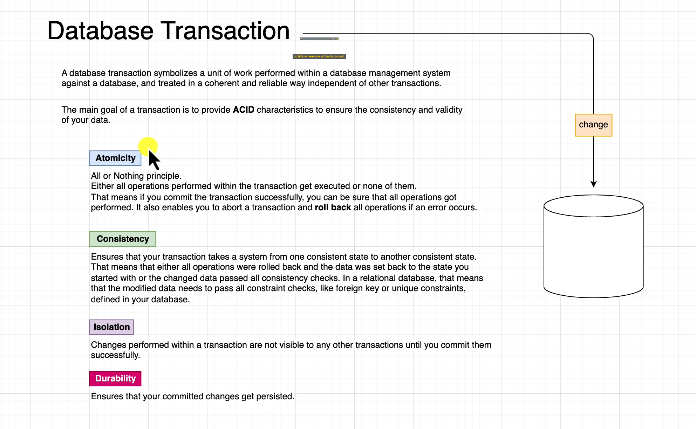

## 🔹 Transactional

---

### 📌 What is `@Transactional`?

`@Transactional` is a Spring annotation used to define the **scope of a database transaction**.

When applied to a method or class, it ensures that:
- All database operations inside the method run in a **single transaction**.
- If any exception occurs, the entire transaction is **rolled back**.
- If the method completes successfully, all changes are **committed**.

---

### 🔸 Why use it?

- Ensures **data consistency** and **integrity**.
- Prevents partial updates (e.g., one entity saved, another failed).
- Makes sure **lazy-loaded associations** work within the transaction.

---

### ✅ Example

```java
@Service
public class StudentService {

    @Transactional
    public void registerStudent(Student student, StudentIdCard card) {
        studentRepository.save(student);
        card.setStudent(student);
        studentIdCardRepository.save(card);
    }
}
```

in Repository 

- can use on interface level or method level 
- default value for transaction is redOnly = true 
- not need write on interface level because in SimpleJpaRepository it's write transaction(readeOnly = true)


in Service :
- use transaction when call more than repository like (save/update) role then save/update) user 
- to avoid problrm don't save role but commit user and leve role


## 🔹 Transactional in Repository and Service Layers

---

### 🔸 In Repository Layer

- `@Transactional` can be applied at the **interface** or **method** level.
- By default, Spring Data applies `@Transactional(readOnly = true)` to repository methods.
- You **do not need** to explicitly annotate repository interfaces because Spring’s `SimpleJpaRepository` already includes the `@Transactional(readOnly = true)` configuration.

---

### 🔸 In Service Layer

- Use `@Transactional` when a service method involves **multiple repository operations** (e.g., saving a role, then saving a user).
- This ensures **atomicity**—either all operations succeed, or all are rolled back.
- Without it, one operation (e.g., saving the user) may commit, while another (e.g., saving the role) may fail, leaving inconsistent data.

✅ Example:

```java
@Transactional
public void createUserWithRole(User user, Role role) {
    roleRepository.save(role); // Save role
    user.setRole(role);
    userRepository.save(user); // Save user
}
```


they ensure data consistency , they prevent race conditions, optimize preformance and give


---

## DB Transaction 
 
- is a series of one or more DML statements
- has a begin and end 
- committing will make the data change permanent
- rollback will revert the changed data to the original state

## ACID

- Atomicity - all or nothing
- Consistency - transaction are valid to rules of the DB
- Isolation - Results of transaction are as if they are done end to end
- Durability - once a transaction is committed it remains so


## Transactions & ACID - what does it mean ?
- Atomicity - All statements must be able to complete
- Consistency - changes do not violate constraints
- Isolation - reads inside the transaction see changed data. reads outside transaction see original data (until commit)
- Durability - once committed change are permanent
- Easy with one user, becomes very complex whit many transacting users!

## Lost update 
- ACID can lead to lost updates
- Mohammed reads balance is 10 and decides to add 5. thus: 10 + 5  = 15
- before mohammed commits that transaction, nasser reads balance is 10 and decides to add 10. thus: 10 + 10 = 20
- Actual balance should be 10 + 5 + 10 = 25
- But balance is updated to 20, because mohammed update is lost since nasser transaction never sees updated value 

## Preventing Lost Updates
- Locking is one technique which can be used to prevent lost updates
- Pessimistic Locking - use DB lock to prevent inflight transactions and will allow transactions to complete sequentially
Ex: select for update will wait for exclusive lock 
- Optimistic Locking - uses a version property which is checked in the update


## RDBMS (have 4 characteristics)
- Data Definition - define the data being tracked
- Data Manipulation (DML)- add, update or remove data 
- Data Retrieval - extract and report on the data im the database
- Administration - defining users on the system, security, monitoring, system administration

## ANSI Data Type
- 